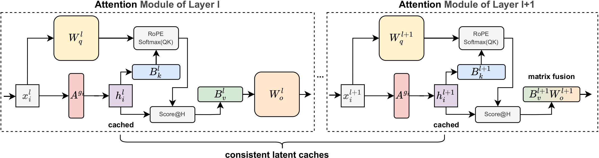

<h2 align="center">CommonKV: Compressing KV Cache with Cross-layer Parameter Sharing</h2>

<p align="center">
    | <a href="https://www.arxiv.org/abs/2508.16134"><b>Paper</b></a> |
</p>

  

CommonKV, a training-free method for cross-layer KV cache compression through adjacent parameters sharing.
By integrating other approaches, we can ultimately achieve a 98% compression ratio without significant performance loss.


## Requirements

```python
transformers >= 4.44
```


## Inference


We support inference code on `LongBench` and `RULER` to repuduce our result.

Please refer to `scripts/scripts_longBench/eval.sh` and `scripts/scripts_ruler/eval.sh` to modify the parameters according to your requirements.


```bash
export CUDA_VISIBLE_DEVICES=$1

method=$2 
max_capacity_prompts=8950 
attn_implementation=eager 
source_path=$3  
model_path=$4 
quant_method=$5 
nbits=$6 
save_dir=${source_path}"results_long_bench" 
rank=4098
layer_step=4

python run_longbench.py \
    --method ${method} \
    --model_path ${model_path} \
    --max_capacity_prompts ${max_capacity_prompts} \
    --attn_implementation ${attn_implementation} \
    --layer_step ${layer_step} \
    --rank ${rank} \
    --save_dir ${save_dir} \


```

```bash
export CUDA_VISIBLE_DEVICES=$1

method=$2 
max_capacity_prompts=7950 
attn_implementation=eager 
result_path=$3  
model_path=$4  
quant_method=$5 
nbits=$6 
save_dir=${result_path}"results_ruler" 
rank=4096
layer_step=4

python3 run_ruler.py \
    --method ${method} \
    --model_path ${model_path} \
    --max_capacity_prompts ${max_capacity_prompts} \
    --attn_implementation ${attn_implementation} \
    --layer_step ${layer_step} \
    --rank ${rank} \
    --save_dir ${save_dir} \
    --use_cache True \
```

* CUDA_VISIBLE_DEVICES: For multi-GPU inference for big LLMs, just need to specify CUDA_VISIBLE_DEVICES=0,1,2,3,4,5,6,7. For single GPU inference, just need to specify CUDA_VISIBLE_DEVICES=0.
* model_path: Path to your model. Support "Llama-3.1-8B-Instruct" and "Mistral-7B-Instruct-v0.2" for now.
* save_dir: Path to your dir to save LongBench result.

After modifying parameters, run:

```bash 
sh scripts/scripts_longBench/eval.sh
```
```bash 
sh scripts/scripts_ruler/eval.sh
```

## Citation
If you find this work is useful for your research, please cite our paper:
```
@article{wang2025commonkv,
  title={CommonKV: Compressing KV Cache with Cross-layer Parameter Sharing},
  author={Wang, Yixuan and Qiao, Haoyu and Li, Lujun and Zhu, Qingfu and Che, Wanxiang},
  journal={arXiv preprint arXiv:2508.16134},
  year={2025}
}
```
